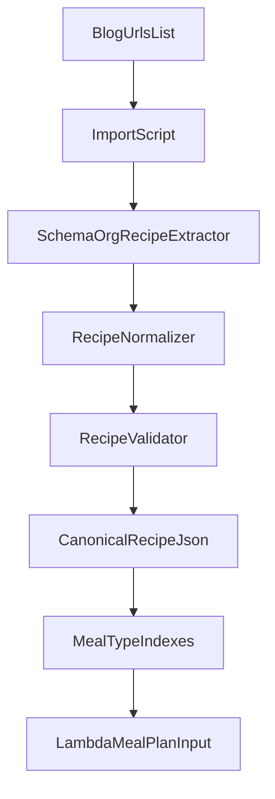

# Blog Recipe Import Plan

## Recommended approach

Build an offline import script, not runtime scraping. The current app reads static recipe files and randomly selects meals from them, so fetching blogs during requests would add latency, fragility, and legal/ops complexity without helping the user experience. A manual importer lets you review recipes before they become app data.

The best design is a two-layer model:

- Keep structured canonical recipe records in a new dataset such as [data/recipes_json/recipes.json](/Users/mounitha/Desktop/PantryBuddy/data/recipes_json/recipes.json) or one file per meal type with full objects.
- Generate or maintain meal-type indexes that the existing planner can still consume, based on [backend/config.py](/Users/mounitha/Desktop/PantryBuddy/backend/config.py) and [backend/lambda_function.py](/Users/mounitha/Desktop/PantryBuddy/backend/lambda_function.py).

This avoids breaking the current app contract immediately while giving you room to store source URL, ingredients, instructions, cuisine, diet, and nutrition.

## Why this is the best fit

- [backend/lambda_function.py](/Users/mounitha/Desktop/PantryBuddy/backend/lambda_function.py) currently expects non-empty recipe collections and randomly selects from them.
- [docs/HIGH_LEVEL_DESIGN_v2.md](/Users/mounitha/Desktop/PantryBuddy/docs/HIGH_LEVEL_DESIGN_v2.md) documents `data/recipes_json` as arrays of recipe names, so replacing them in-place with arbitrary blog HTML-derived objects would break assumptions unless the backend/frontend are updated together.
- [infrastructure/lib/pantrybuddy-stack.ts](/Users/mounitha/Desktop/PantryBuddy/infrastructure/lib/pantrybuddy-stack.ts) already deploys `data/recipes_json` to S3, which is a good fit for curated generated artifacts.

## Target architecture

## Data model direction

Use a canonical recipe shape like:

- `id`
- `title`
- `sourceUrl`
- `sourceName`
- `mealType`
- `diet`
- `cuisine`
- `ingredients`
- `instructions`
- `nutrition`
- `image`

For blog extraction, prefer `schema.org/Recipe` JSON-LD in the page first, then fall back to lightweight HTML parsing only when needed. Many recipe blogs already publish machine-readable recipe metadata this way, which is much more reliable than scraping visible text.

## Files to change

- Update [backend/lambda_function.py](/Users/mounitha/Desktop/PantryBuddy/backend/lambda_function.py) so the planner can read structured recipes or derived indexes instead of plain strings.
- Update [docs/HIGH_LEVEL_DESIGN_v2.md](/Users/mounitha/Desktop/PantryBuddy/docs/HIGH_LEVEL_DESIGN_v2.md) to document the new recipe schema and import workflow.
- Add an importer script under a utility folder such as `tools/` or `scripts/`.
- Add new structured recipe data files under [data/recipes_json](/Users/mounitha/Desktop/PantryBuddy/data/recipes_json).
- Optionally repurpose or regenerate [data/recipes_text](/Users/mounitha/Desktop/PantryBuddy/data/recipes_text) from canonical data if you still want human-readable recipe files.

## Implementation phases

1. Define the canonical recipe schema and sample output.
2. Create a blog URL input list for the recipe sources you trust.
3. Build an importer that fetches a blog page and extracts `schema.org/Recipe` metadata.
4. Normalize extracted fields into your PantryBuddy schema and classify each recipe into breakfast/lunch/snack/dinner.
5. Add validation so bad or partial recipes are skipped and reported.
6. Write generated JSON artifacts into `data/recipes_json`.
7. Update backend selection logic to use structured recipes while preserving current meal-plan output shape.
8. Update docs and test locally with `RECIPE_DATA_SOURCE=local`.

## Important guardrails

- Do not scrape blogs indiscriminately; start from a small curated source list.
- Preserve `sourceUrl` and `sourceName` for attribution.
- Treat importer output as reviewable content, not fully trusted input.
- Keep a compatibility layer so the frontend does not need a large rewrite immediately.

## Suggested first milestone

Deliver one script that imports 5-10 recipes from a small curated list of blog URLs and writes validated structured JSON plus meal-type outputs. Once that works, expand the source list and improve classification/filtering.
