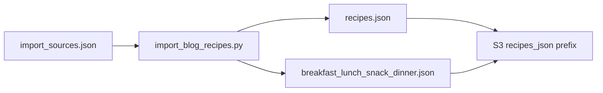

# Expand blog recipe manifest and regenerate artifacts

## Scope and counts

- **Target:** Add **20 new recipe URLs per category** (`breakfast`, `lunch`, `snack`, `dinner`) → **80 new entries**.
- **Indian subset:** **5 URLs per category** must be Indian-focused blogs, with `"cuisine": "Indian"` (and accurate `diet` / `sourceName` as needed).
- **Existing four URLs** in the current manifest should remain so the dataset stays a superset of what already shipped; after import you should have **84 canonical recipes** (unless some URLs fail and are swapped).

## How production picks up data

- CDK deploys the entire [`data/recipes_json/`](data/recipes_json/) tree to S3 ([`infrastructure/lib/pantrybuddy-stack.ts`](infrastructure/lib/pantrybuddy-stack.ts)); the Lambda reads [`recipes_json/recipes.json`](data/recipes_json/recipes.json) (canonical) and legacy [`recipes_json/{breakfast,lunch,snack,dinner}.json`](data/recipes_json/) indexes per [`backend/config.py`](backend/config.py).
- **Required outputs:** updated `recipes.json` plus regenerated **meal index JSON files** so both modes stay consistent.

## Manifest format

Each line in [`import_sources.json`](data/recipes_json/import_sources.json) must match what [`load_sources()`](tools/import_blog_recipes.py) expects:

- `url` (required)
- `mealType` — **always set** for every entry. The importer honors this override ([`infer_meal_type`](tools/import_blog_recipes.py)); if omitted, import can fail with *"Could not infer mealType"* when the page text does not match built-in keywords.
- Optional: `diet`, `cuisine`, `sourceName` (camelCase, matching the sample file).

## Curation strategy (real blogs + schema.org)

The importer needs pages it can parse: **schema.org `Recipe` JSON-LD** is preferred; fallback HTML parsing requires clear `Ingredients` / `Instructions` sections ([`import_recipe`](tools/import_blog_recipes.py)).

**Suggested non-Indian pools (examples of types of sites that usually work):** established food blogs with standard recipe cards (e.g. categories similar to existing Minimalist Baker / Love and Lemons / Nora Cooks / Cookie and Kate).

**Suggested Indian pools (aim for 5 URLs per meal type):** reputable sites that publish full recipe posts with structured data, e.g. **Veg Recipes of India**, **Cook With Manali**, **Dassana’s Veg Recipes**, **Spice Up The Curry**, **Archana’s Kitchen**, **Indian Healthy Recipes** — pick permalinks that match the intended meal (e.g. paratha/idli/upma for breakfast; dal/rice/curry bowls for lunch; chaat/namkeen/snack plates for snack; curries/biryanis/main dishes for dinner).

**Operational tip:** When executing (not in plan mode), run the importer with `--verbose` to see per-URL failures; replace any URL that fails validation (missing title/ingredients/instructions) or returns blocked HTML.

## Commands to run (after plan approval)

From repo root, with network access:

1. **Merge new imports into the existing canonical file** (so you do not drop the current four recipes unless you intentionally replace the whole manifest and re-import everything):

```bash
python tools/import_blog_recipes.py \
  --sources data/recipes_json/import_sources.json \
  --output data/recipes_json/recipes.json \
  --merge-existing \
  --write-indexes \
  --timeout 25 \
  --verbose
```

- `--merge-existing` uses [`merge_recipes`](tools/import_blog_recipes.py) (dedupes by `id` / `sourceUrl`).
- `--write-indexes` regenerates [`breakfast.json`](data/recipes_json/breakfast.json), [`lunch.json`](data/recipes_json/lunch.json), [`snack.json`](data/recipes_json/snack.json), [`dinner.json`](data/recipes_json/dinner.json) beside the canonical file.

2. **If** the importer reports many failures, fix the manifest (swap URLs) and rerun the same command until failures are acceptable.

3. **Validate:** Run targeted tests, e.g. `pytest tests/test_import_blog_recipes.py` (and any backend tests you normally run before deploy). Optionally spot-check `recipes.json` against [`recipes.schema.json`](data/recipes_json/recipes.schema.json) using the same workflow described in [`docs/HIGH_LEVEL_DESIGN_v2.md`](docs/HIGH_LEVEL_DESIGN_v2.md) (manual or project tooling).

4. **Production visibility:** Merge to `main` so the existing GitHub Actions / CDK pipeline republishes `data/recipes_json` to the data bucket (no separate “normalize” script beyond the importer + indexes unless you also maintain [`recipes.sample.json`](data/recipes_json/recipes.sample.json) for dev-only samples — that file is **not** required for Lambda behavior).

## Risk / edge cases

- **Fetch failures:** paywalls, bot blocking, or missing JSON-LD will skip or fail a URL.
- **Snack + Indian:** explicitly label `mealType: "snack"` in the manifest even if the blog calls it “appetizer” or “tea-time.”
- **Duplicate titles:** merge dedupes by URL/id; two different URLs with the same title get different ids ([`build_recipe_id`](tools/import_blog_recipes.py)).


