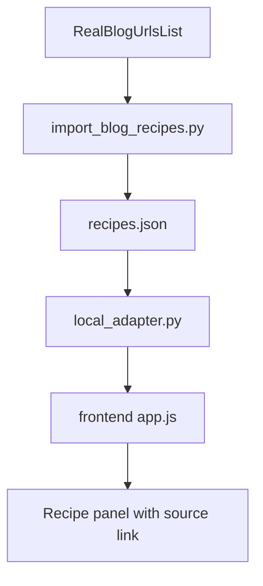

# Real Blog URL Rollout Plan

## Goal

Replace example blog URLs with a real curated source list, make those URLs visible in the API and UI, verify the full import -> backend -> frontend flow locally, and leave the branch ready for a production merge/deploy workflow.

## Current State

- `[/Users/mounitha/Desktop/PantryBuddy/data/recipes_json/import_sources.json](/Users/mounitha/Desktop/PantryBuddy/data/recipes_json/import_sources.json)` now contains a small real-world curated manifest covering all four meal types, while `[/Users/mounitha/Desktop/PantryBuddy/data/recipes_json/import_sources.sample.json](/Users/mounitha/Desktop/PantryBuddy/data/recipes_json/import_sources.sample.json)` remains the template.
- `[/Users/mounitha/Desktop/PantryBuddy/tools/import_blog_recipes.py](/Users/mounitha/Desktop/PantryBuddy/tools/import_blog_recipes.py)` imports the curated sources into canonical recipes with `sourceUrl` and `sourceName`, and focused importer tests cover artifact/index generation behavior.
- `[/Users/mounitha/Desktop/PantryBuddy/backend/lambda_function.py](/Users/mounitha/Desktop/PantryBuddy/backend/lambda_function.py)` returns source metadata in recipe detail objects, and backend tests verify the `/v2/generate-meal-plan` response shape.
- `[/Users/mounitha/Desktop/PantryBuddy/frontend/app.js](/Users/mounitha/Desktop/PantryBuddy/frontend/app.js)` preserves and renders source attribution, with shared normalization logic extracted into `[/Users/mounitha/Desktop/PantryBuddy/frontend/meal_planner_model.js](/Users/mounitha/Desktop/PantryBuddy/frontend/meal_planner_model.js)` for direct testing.
- `[/Users/mounitha/Desktop/PantryBuddy/tools/run_local_frontend_e2e.py](/Users/mounitha/Desktop/PantryBuddy/tools/run_local_frontend_e2e.py)`, `[/Users/mounitha/Desktop/PantryBuddy/Makefile](/Users/mounitha/Desktop/PantryBuddy/Makefile)`, and `[/Users/mounitha/Desktop/PantryBuddy/tests/LOCAL_QA.md](/Users/mounitha/Desktop/PantryBuddy/tests/LOCAL_QA.md)` now provide a repeatable local browser QA workflow with headed playback, trace/video/screenshots, and documented commands.
- `[/Users/mounitha/Desktop/PantryBuddy/infrastructure/lib/pantrybuddy-stack.ts](/Users/mounitha/Desktop/PantryBuddy/infrastructure/lib/pantrybuddy-stack.ts)` and `[/Users/mounitha/Desktop/PantryBuddy/.github/workflows/deploy-infrastructure.yml](/Users/mounitha/Desktop/PantryBuddy/.github/workflows/deploy-infrastructure.yml)` already publish `data/recipes_json`, backend, and frontend changes to Prod when merged to `main`.

## Implementation Plan

### 1. Curate the real BlogUrlsList

- Add a real reviewed manifest alongside the sample file, likely under `[/Users/mounitha/Desktop/PantryBuddy/data/recipes_json/](/Users/mounitha/Desktop/PantryBuddy/data/recipes_json/)`, and keep the sample file as a template.
- Start with a small vetted set that covers all four meal types so `[tools/import_blog_recipes.py](file:///Users/mounitha/Desktop/PantryBuddy/tools/import_blog_recipes.py)` can generate non-empty canonical/index artifacts.
- Pre-fill `mealType` for sources that may not infer cleanly, and use `sourceName` overrides when the site publisher metadata is messy.
- Decide whether the real manifest should remain committed or be maintained as a private/operator-managed file; if it stays committed, keep it strictly to public recipe URLs and review-friendly metadata.

### 2. Propagate blog source metadata through the product

- Update `[/Users/mounitha/Desktop/PantryBuddy/backend/lambda_function.py](/Users/mounitha/Desktop/PantryBuddy/backend/lambda_function.py)` so `_build_recipe_detail()` includes at least `sourceUrl` and `sourceName` in every recipe object returned by `/v2/generate-meal-plan`.
- Extend backend tests in `[/Users/mounitha/Desktop/PantryBuddy/tests/test_lambda_function.py](/Users/mounitha/Desktop/PantryBuddy/tests/test_lambda_function.py)` to assert the new response fields survive both canonical and legacy-enriched paths.
- Update frontend normalization in `[/Users/mounitha/Desktop/PantryBuddy/frontend/app.js](/Users/mounitha/Desktop/PantryBuddy/frontend/app.js)` so `sourceUrl` and `sourceName` are preserved in local state.
- Add a simple recipe-panel UI treatment for attribution, such as a source label plus an external-link action when `sourceUrl` exists.
- Refresh the response contract in `[/Users/mounitha/Desktop/PantryBuddy/docs/HIGH_LEVEL_DESIGN_v2.md](/Users/mounitha/Desktop/PantryBuddy/docs/HIGH_LEVEL_DESIGN_v2.md)` so docs match the API/UI behavior.

### 3. Validate importer outputs and generated artifacts

- Run the importer against the curated manifest using merge/replace rules that match the intended rollout, then regenerate meal indexes if needed.
- Verify the resulting `[/Users/mounitha/Desktop/PantryBuddy/data/recipes_json/recipes.json](/Users/mounitha/Desktop/PantryBuddy/data/recipes_json/recipes.json)` contains real `sourceUrl`/`sourceName` values and still satisfies schema expectations.
- Confirm every meal bucket remains populated in the canonical artifact and derived `breakfast.json`, `lunch.json`, `snack.json`, and `dinner.json` compatibility files.
- Add or update importer-focused tests in `[/Users/mounitha/Desktop/PantryBuddy/tests/test_import_blog_recipes.py](/Users/mounitha/Desktop/PantryBuddy/tests/test_import_blog_recipes.py)` only where they reduce risk for real-world manifest parsing or dedupe behavior.

### 4. Run end-to-end local verification

- Use `[/Users/mounitha/Desktop/PantryBuddy/backend/local_adapter.py](/Users/mounitha/Desktop/PantryBuddy/backend/local_adapter.py)` with `RECIPE_DATA_SOURCE=local` so the frontend can hit a local API while reading the newly generated artifacts from disk.
- Use `[/Users/mounitha/Desktop/PantryBuddy/tools/run_local_frontend_e2e.py](/Users/mounitha/Desktop/PantryBuddy/tools/run_local_frontend_e2e.py)` as the repeatable browser smoke runner, and expose it through `[/Users/mounitha/Desktop/PantryBuddy/Makefile](/Users/mounitha/Desktop/PantryBuddy/Makefile)` targets documented in `[/Users/mounitha/Desktop/PantryBuddy/tests/LOCAL_QA.md](/Users/mounitha/Desktop/PantryBuddy/tests/LOCAL_QA.md)`.
- Verify this path explicitly:

- Test the main user journey: generate a meal plan, open multiple recipe cards, confirm source attribution renders, and confirm real links correspond to the imported recipe source.
- Spot-check raw API responses for `sourceUrl` and `sourceName`, not just rendered UI.
- Capture observability artifacts for local QA runs: `trace.zip`, browser video, and per-step screenshots under `[/Users/mounitha/Desktop/PantryBuddy/test-results/local-e2e/](/Users/mounitha/Desktop/PantryBuddy/test-results/local-e2e/)`.

### 5. Prepare production rollout steps

- Treat Prod as a merge-triggered deployment: once validated, the branch should be ready to merge to `main`, which will trigger `[deploy-infrastructure.yml](file:///Users/mounitha/Desktop/PantryBuddy/.github/workflows/deploy-infrastructure.yml)`.
- Before merge, verify the hardcoded production API base in `[/Users/mounitha/Desktop/PantryBuddy/frontend/config.js](/Users/mounitha/Desktop/PantryBuddy/frontend/config.js)` still matches the current CDK/API Gateway output or plan to remove that drift risk.
- Define a post-deploy smoke test checklist: open the deployed site, generate a meal plan, inspect at least one recipe from the curated manifest, and confirm the blog link opens the expected source.
- Document rollback guidance focused on reverting the committed artifact/UI/backend changes if a bad source list or broken rendering reaches Prod.

## Acceptance Criteria

- A real curated BlogUrlsList exists and imports successfully into canonical recipe data.
- `/v2/generate-meal-plan` returns `sourceUrl` and `sourceName` for recipe objects.
- The frontend shows recipe source attribution/linking without breaking the current meal-plan flow.
- Local end-to-end validation passes using generated artifacts and the local adapter.
- The branch includes the docs/test/deploy notes needed for a safe merge-to-Prod workflow.

