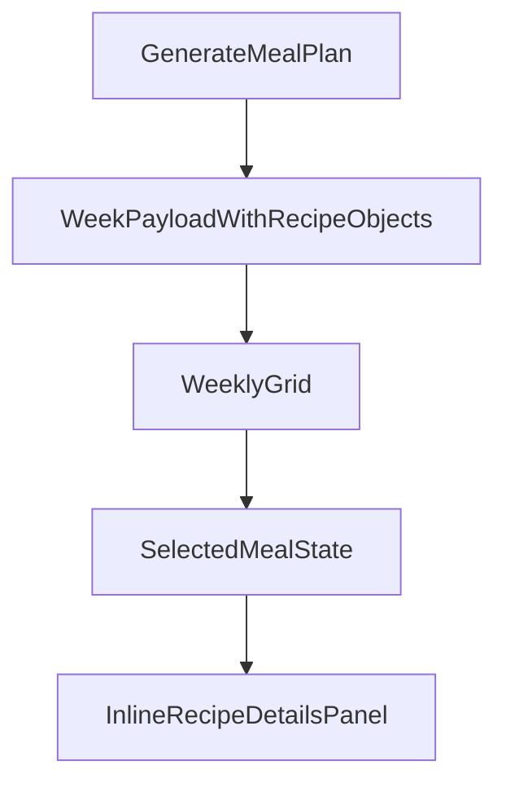

# Recipe Detail Panel Plan

## Goal

Update PantryBuddy so clicking a meal in the weekly planner shows recipe details on the same page in an inline details panel. The panel should display `mealType`, `diet`, `cuisine`, `ingredients`, `instructions`, and `nutrition`.

## Recommended approach

Use the backend as the source of truth for recipe details. The current frontend only receives recipe titles, because [backend/lambda_function.py](/Users/mounitha/Desktop/PantryBuddy/backend/lambda_function.py) builds each week slot from `_normalize_recipe_choice(...)` and returns strings. Since you chose the backend-driven path, the cleanest change is to have the week payload return structured meal objects instead of plain strings.

Recommended response shape for each slot:

- `id`
- `title`
- `mealType`
- `diet`
- `cuisine`
- `ingredients`
- `instructions`
- `nutrition`

That keeps the frontend simple and avoids a second client-side lookup against `recipes.json`.

## Scope

- Update [backend/lambda_function.py](/Users/mounitha/Desktop/PantryBuddy/backend/lambda_function.py) to preserve selected canonical recipe objects in the week payload instead of reducing them to strings.
- Update [frontend/app.js](/Users/mounitha/Desktop/PantryBuddy/frontend/app.js) to normalize/render meal slots as recipe objects, track the selected meal, and show an inline details panel.
- Update [frontend/index.html](/Users/mounitha/Desktop/PantryBuddy/frontend/index.html) styles for clickable meal cells and the details panel layout.
- Update [tests/test_lambda_function.py](/Users/mounitha/Desktop/PantryBuddy/tests/test_lambda_function.py) for the widened API contract.
- Update [docs/HIGH_LEVEL_DESIGN_v2.md](/Users/mounitha/Desktop/PantryBuddy/docs/HIGH_LEVEL_DESIGN_v2.md) so the frontend/backend contract matches the new UI.

## Backend changes

1. Change `build_week_plan()` in [backend/lambda_function.py](/Users/mounitha/Desktop/PantryBuddy/backend/lambda_function.py) so each selected meal is returned as a recipe object rather than a title string.
2. Add a small response-shaping helper to limit the payload to only the fields the UI needs.
3. Preserve compatibility for legacy string-based index files by expanding selected string entries into a minimal object shape when needed, or make canonical mode the required runtime for this UI.
4. Keep the top-level response as `{ "week": [...] }` so only the meal slot shape changes.

## Frontend changes

1. Update `normalizeWeekData()` in [frontend/app.js](/Users/mounitha/Desktop/PantryBuddy/frontend/app.js) so each meal slot can safely hold a recipe object.
2. Replace the static `meal-value` text block with an interactive element for populated meals.
3. Add frontend state such as `selectedRecipe` and `selectedContext` to track the clicked meal.
4. Render an inline details panel beneath or beside the weekly grid:
  - Header with `title`
  - Metadata row for `mealType`, `diet`, `cuisine`
  - Ingredients list
  - Instructions list
  - Nutrition summary
5. Add empty/default handling when optional fields like `diet`, `cuisine`, or nutrition values are null.
6. Add keyboard-accessible click behavior and visible selection state.

## Layout direction

Use a dedicated inline details panel under the grid on smaller screens and beside the grid on wider screens if the current layout allows it. This keeps the user on the same page and avoids modal complexity.

## Important implementation notes

- The current frontend assumes each meal is a string in [frontend/app.js](/Users/mounitha/Desktop/PantryBuddy/frontend/app.js), so rendering and empty-state checks must be updated carefully.
- The current tests in [tests/test_lambda_function.py](/Users/mounitha/Desktop/PantryBuddy/tests/test_lambda_function.py) explicitly assert string meal values, so those assertions will need to be replaced with object-shape assertions.
- The documented frontend response in [docs/HIGH_LEVEL_DESIGN_v2.md](/Users/mounitha/Desktop/PantryBuddy/docs/HIGH_LEVEL_DESIGN_v2.md) currently shows string values and should be updated to reflect the richer payload.

## Suggested validation

- Unit tests for new meal-plan payload shape.
- Manual local API test via [backend/local_adapter.py](/Users/mounitha/Desktop/PantryBuddy/backend/local_adapter.py).
- Browser smoke test to confirm clicking a meal updates the details panel and renders all required fields.

## Risk to watch

If the backend still runs from legacy title-only index files, the UI will not have enough detail to populate the panel. The plan should either enforce canonical recipe usage for this feature or add a backend lookup step from title/id to canonical recipe objects before returning the response.
