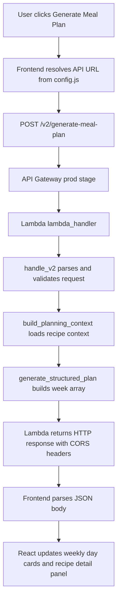
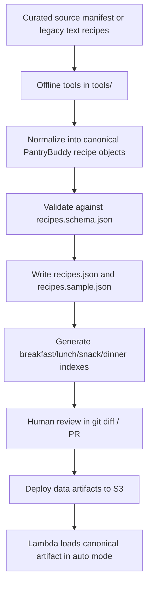
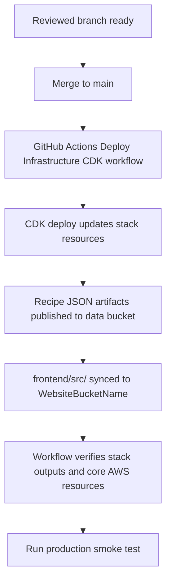

# PantryBuddy - High-Level Design Documentation
## Weekly Meal Planner (V2 Update)

**Version:** 2.4  
**Date:** March 2026  
**Status:** V2 Production-Aligned

---

## 1. System Overview

### 1.1 Purpose
PantryBuddy is a web-based meal planning application that generates a weekly meal plan from curated recipe categories (breakfast, lunch, snack, dinner). The current V2 design keeps the lightweight no-login flow while standardizing the active API route, introducing a future-ready request contract, and supporting both deployed and local-debug execution paths.

### 1.2 Key Features
- **Weekly Meal Plan Generation**: Automatically generates a 7-day plan
- **Random Recipe Selection**: Selects recipes from categorized lists
- **Card-Based Weekly UI**: Static frontend renders a current-week planner with day/date cards
- **Serverless Architecture**: API Gateway + Lambda + S3
- **Deployment Consistency**: Infrastructure and frontend deployment aligned to the same stack outputs
- **Local Debug Support**: Frontend can target a localhost adapter without changing production defaults
- **Structured Recipe Compatibility**: Backend can select from canonical recipe objects while preserving the existing API response shape

### 1.3 Target Users
- Individuals looking to simplify weekly meal planning
- Users who want variety in meals without manual curation
- Users who prefer a lightweight, no-login planner experience

---

## 2. System Architecture

### 2.1 High-L evel Architecture

```text
┌─────────────────────────────┐
│        Web Browser          │
│  Static frontend + config   │
└──────────────┬──────────────┘
               │ HTTPS POST /v2/generate-meal-plan
               │
     ┌─────────▼─────────┐
     │  AWS API Gateway  │
     │   prod stage      │
     └─────────┬─────────┘
               │ Lambda proxy integration
               ▼
┌─────────────────────────────┐
│     AWS Lambda Function     │
│ validate -> retrieve ->     │
│ generate -> respond         │
└──────────────┬──────────────┘
               │
               ▼
┌─────────────────────────────┐
│       AWS S3 Data Bucket    │
│   recipes_json/*.json files │
└─────────────────────────────┘

Optional local debug path:
Browser -> Local adapter (`backend/local_adapter.py`) -> `lambda_handler()`
```

### 2.2 Architecture Components
1. **Frontend Layer** (`frontend/`)
   - Static HTML/CSS/JavaScript with React loaded from CDN
   - Client-side rendering via `app.js`
   - API endpoint resolution via `config.js`
   - Cache-busted script loading in `index.html`

2. **API Layer** (AWS API Gateway)
   - Public REST endpoint
   - Route and method dispatch
   - CORS-enabled responses

3. **Backend Layer** (`backend/`)
   - Lambda handler with route-aware v1/v2 dispatch
   - Request validation for optional personalization-style fields
   - Retrieval boundary and structured plan generation boundary for future AI/KB evolution

4. **Data Layer** (AWS S3)
   - Canonical recipe artifact plus derived compatibility indexes in `recipes_json/`
   - Durable object storage for runtime reads

---

## 3. Component Details

### 3.1 Frontend Components

#### 3.1.1 `index.html`
- **Purpose**: Main UI layout
- **Key Elements**:
  - Root mount element for React app
  - Responsive card-based weekly layout styling
  - Cache-busted script tags for `config.js` and `app.js`
- **Dependencies**: `app.js`, `config.js`

#### 3.1.2 `config.js`
- **Purpose**: Centralized endpoint/version configuration
- **Key Responsibilities**:
  - Resolve production API base URL
  - Provide localhost-only override for local debugging contexts
  - Map versioned endpoint paths
- **Current Active Version**: `v2`
- **Current Production Base URL**: `https://bkq2ftn73g.execute-api.us-east-2.amazonaws.com/prod`

#### 3.1.3 `app.js`
- **Purpose**: Frontend request/response handling
- **Key Functions**:
  - `MealPlannerApp()`: React app shell for state, loading, errors, and selected recipe details
  - `generateMealPlan()`: Sends POST to configured API endpoint
  - `normalizeWeekData(rawWeek, weekDates)`: Aligns API output to UI week order and normalizes recipe objects
  - `buildWeekDates()`: Computes Monday-to-Sunday labels for the current week

### 3.2 Backend Components

#### 3.2.1 `lambda_function.py`
- **Purpose**: Main Lambda entry point for meal planning
- **Key Functions**:
  - `lambda_handler(event, context)`: Route-aware entry point
  - `load_all_recipes()`: Loads meal categories from the canonical artifact when available, otherwise from legacy indexes
  - `build_week_plan(recipes)`: Constructs 7-day meal plan
  - `validate_request(body)`: Validates optional request fields
  - `build_planning_context(body)`: Loads recipes and request-scoped fields used for planning; can be extended for additional sources later
  - `generate_structured_plan(body, planning_context)`: Returns the logical `week` payload
  - `handle_v2(event)`: v2-compatible request path with validation/retrieval hooks
 - **Compatibility Behavior**:
   - `RECIPE_COMPATIBILITY_MODE=indexes` forces legacy `breakfast/lunch/snack/dinner.json` reads
   - `RECIPE_COMPATIBILITY_MODE=canonical` forces direct runtime grouping from `recipes.json`
   - `RECIPE_COMPATIBILITY_MODE=auto` prefers `recipes.json` and falls back to legacy indexes if the canonical artifact is unavailable or invalid

#### 3.2.2 `config.py`
- **Purpose**: Runtime configuration for API endpoints, data source mode, and AWS settings
- **Key Values**:
  - Active endpoint map (`/v2/generate-meal-plan`)
  - `RECIPE_DATA_SOURCE` toggle (`s3` vs `local`)
  - `CANONICAL_RECIPE_FILE` path for the structured recipe artifact
  - `RECIPE_COMPATIBILITY_MODE` toggle for canonical/index fallback behavior

#### 3.2.3 `local_adapter.py`
- **Purpose**: Local HTTP adapter that exposes Lambda-compatible routes during local development
- **Key Responsibilities**:
  - Accept POST requests on localhost
  - Normalize supported v1/v2 route paths
  - Convert HTTP requests into API Gateway proxy-style Lambda events
  - Return Lambda responses with browser-friendly CORS headers

### 3.3 Data Components

#### 3.3.1 Recipe JSON Files (`data/recipes_json/`)
- `breakfast.json`
- `lunch.json`
- `snack.json`
- `dinner.json`
- **Format**: JSON array of recipe titles or ids derived from the canonical artifact
- **Role**: Compatibility indexes for older runtime paths, lightweight review, and operational fallback

#### 3.3.2 Canonical Structured Recipe Artifact
- `recipes.schema.json`
- `recipes.sample.json`
- `recipes.json`
- **Purpose**: Define the future canonical recipe object model used by offline import/review workflows
- **Compatibility Model**: The canonical artifact is now the preferred runtime source in `auto` mode, while the meal-type index files remain generated compatibility artifacts and fallbacks

#### 3.3.3 Canonical Recipe Shape

| Field | Type | Required | Description |
|------|------|----------|-------------|
| `id` | `string` | Yes | Stable recipe identifier safe for filenames, indexing, and deduplication |
| `title` | `string` | Yes | User-facing recipe name |
| `sourceUrl` | `string \| null` | Yes | Original recipe URL for attribution and traceability |
| `sourceName` | `string \| null` | Yes | Human-readable source label such as a blog or internal seed dataset |
| `mealType` | `string` | Yes | One of `breakfast`, `lunch`, `snack`, or `dinner` |
| `diet` | `string \| null` | Yes | Primary diet label such as `vegetarian`, `vegan`, or `high-protein` |
| `cuisine` | `string \| null` | Yes | Primary cuisine label such as `Indian` or `Mediterranean` |
| `ingredients` | `object[]` | Yes | Structured ingredient entries with name plus optional quantity metadata |
| `instructions` | `object[]` | Yes | Ordered preparation steps |
| `nutrition` | `object` | Yes | Structured nutrient summary with nullable values when unavailable |
| `image` | `string \| null` | Yes | Optional image URL for future frontend enrichment |

Example canonical artifact:

```json
{
  "version": "1.0",
  "generatedAt": "2026-03-25T00:00:00Z",
  "sourceType": "mixed",
  "recipes": [
    {
      "id": "avocado-toast",
      "title": "Avocado Toast",
      "sourceUrl": null,
      "sourceName": "PantryBuddy Seed Data",
      "mealType": "breakfast",
      "diet": "vegetarian",
      "cuisine": "Mediterranean",
      "ingredients": [
        {
          "item": "Avocado",
          "amount": 1,
          "unit": "whole",
          "preparation": "mashed"
        },
        {
          "item": "Bread",
          "amount": 2,
          "unit": "slices",
          "preparation": "toasted"
        }
      ],
      "instructions": [
        {
          "step": 1,
          "text": "Toast the bread until golden."
        },
        {
          "step": 2,
          "text": "Spread mashed avocado on toast and serve fresh."
        }
      ],
      "nutrition": {
        "calories": 280,
        "proteinGrams": 13,
        "carbsGrams": null,
        "fatGrams": null
      },
      "image": null
    }
  ]
}
```

The canonical artifact is designed for importer output and human review. The Lambda now groups structured records by `mealType` at runtime and emits compact recipe detail objects for API responses. Derived meal-type index files can still be generated from `recipes[].title` or `recipes[].id` for compatibility and fallback behavior, and legacy title-only selections are enriched from canonical records when available.

---

## 4. Data Flow

### 4.1 Meal Plan Generation Flow



### 4.2 Recipe Import and Review Flow



### 4.3 Request/Response Contract

#### Request
```json
POST /v2/generate-meal-plan
Content-Type: application/json

{
  "preferences": {
    "cuisine": "Indian",
    "style": "vegetarian"
  },
  "dietaryRestrictions": ["nut-free"],
  "allergies": ["peanut"],
  "excludedIngredients": ["mushroom"]
}
```

#### Request Fields

| Field | Type | Required | Description |
|------|------|----------|-------------|
| `preferences` | `string \| object \| string[]` | No | Future-ready preference payload passed through validation/retrieval boundaries |
| `dietaryRestrictions` | `string \| string[]` | No | Optional dietary constraints |
| `allergies` | `string \| string[]` | No | Optional allergy information |
| `excludedIngredients` | `string \| string[]` | No | Ingredients to avoid |

#### Response (Logical Payload Seen by Frontend)
```json
{
  "week": [
    {
      "day": "Monday",
      "breakfast": {
        "id": "oatmeal-with-fruits",
        "title": "Oatmeal with fruits",
        "mealType": "breakfast",
        "diet": "vegetarian",
        "cuisine": "American",
        "ingredients": [
          {
            "item": "Oats",
            "amount": 1,
            "unit": "cup",
            "preparation": null
          }
        ],
        "instructions": [
          {
            "step": 1,
            "text": "Cook the oats and top with fruit."
          }
        ],
        "nutrition": {
          "calories": 320,
          "proteinGrams": 12,
          "carbsGrams": 54,
          "fatGrams": 8
        }
      }
    }
  ]
}
```

#### Validation and Error Behavior
- Non-object JSON bodies return `400`
- Invalid optional field types return `400` with an error message
- Frontend currently shows a generic failure banner when the request fails

### 4.4 Offline Recipe Data Workflow
1. Seed or import recipes offline, never during request handling.
2. Use `tools/generate_recipe_artifacts.py` to parse legacy text recipe seeds in `data/recipes_text/` into `recipes.json`, `recipes.sample.json`, and derived meal indexes.
3. Use `tools/import_blog_recipes.py --sources <manifest>` to fetch curated blog pages, prefer `schema.org/Recipe` metadata, and fall back to lightweight HTML parsing only when needed.
4. Keep source manifests reviewable in JSON form, using fields such as `url`, `mealType`, `diet`, `cuisine`, and `sourceName`.
5. Validate generated artifacts against `recipes.schema.json`, then review canonical fields like `sourceUrl`, `sourceName`, `ingredients`, `instructions`, `nutrition`, and `mealType` before merge/deploy.
6. Regenerate meal-type indexes from the canonical artifact so runtime fallback files stay aligned with `recipes.json`.
7. Deploy reviewed JSON artifacts to S3 with the normal infrastructure workflow.

### 4.5 Review Guardrails
- Start from a small curated source list rather than broad scraping.
- Preserve `sourceUrl` and `sourceName` for attribution and traceability.
- Treat importer output as reviewable content, not trusted production data.
- Ensure every meal type remains non-empty so both canonical runtime grouping and compatibility index generation succeed.
- Prefer `recipes.sample.json` for lightweight spot checks and `recipes.json` for full review.

---

## 5. V1 vs V2 Differences

### 5.1 Summary Table

| Area | V1 | V2 |
|------|----|----|
| Frontend API target | Legacy `/generate-meal-plan` path | Active `/v2/generate-meal-plan` path |
| Frontend config model | Direct or legacy endpoint assumptions | Centralized `config.js` with version map and localhost override |
| UI rendering | Simpler static rendering expectations | React-based weekly card UI with current-week date labels |
| Request contract | Empty-body request only | Supports optional future-ready preference/restriction fields |
| Version routing | Mostly v1 behavior | Route-aware Lambda with explicit v2 handler |
| Local debugging | Ad hoc/manual | `local_adapter.py` mirrors Lambda proxy contract locally |
| Deployment workflows | Higher risk of frontend/backend drift | CDK outputs plus CI sync to stack-managed website bucket |
| Operational reliability | Manual reconciliation needed after endpoint changes | Cache-busted frontend assets reduce stale route/config issues |

### 5.2 Practical Impact
- Reduces `Not Found` and `Missing Authentication Token` incidents caused by stale endpoint drift.
- Ensures frontend assets are deployed to the same bucket created/managed by CDK.
- Improves maintainability by keeping versioned endpoint logic centralized.
- Leaves clean extension points for future personalized or AI-assisted meal-plan generation.

---

## 6. Technology Stack

### 6.1 Frontend
- HTML5
- CSS3
- JavaScript (ES6+)
- React 18 / ReactDOM 18 via CDN
- Bootstrap Icons via CDN
- Fetch API

### 6.2 Backend
- Python 3.11 (Lambda runtime)
- AWS Lambda
- AWS API Gateway (REST)
- AWS S3
- `boto3`

### 6.3 Infrastructure and Delivery
- AWS CDK (TypeScript)
- GitHub Actions
- AWS IAM OIDC-based deploy role

---

## 7. Security and Reliability Considerations

### 7.1 Current State
- CORS currently allows all origins (`*`)
- No end-user auth for Phase 1 API
- Basic request validation in v2 code path
- Local API override is restricted to `localhost` / `127.0.0.1` values

### 7.2 Recommended Next Steps
- Introduce CORS allowlist for known UI origins
- Add rate limiting and throttling strategy
- Add API auth strategy (API key/JWT/Cognito)
- Add error budget and rollback guidance in deployment runbook

---

## 8. Performance and Scalability

### 8.1 Current Characteristics
- Low compute complexity per request
- S3-backed recipe retrieval
- Lambda/API Gateway auto-scaling at service layer
- Frontend performs one POST per generation request and renders entirely client-side

### 8.2 Improvement Opportunities
- Cache recipe payload in-memory during warm Lambda lifecycle
- Add CloudFront distribution in front of website bucket
- Add integration/load tests in CI for endpoint health and latency

---

## 9. Deployment Model

### 9.1 Workflow
1. `Deploy Infrastructure (CDK)` workflow runs on `main` for infra/backend/frontend changes.
2. CDK deploy updates stack resources.
3. Stack deploy publishes recipe JSON to the data bucket and can deploy frontend assets to the website bucket.
4. Workflow resolves `WebsiteBucketName` from stack outputs.
5. Workflow syncs `frontend/src/` to the stack website bucket to ensure the latest static assets are published.
6. Workflow verifies stack, buckets, Lambda, and API Gateway outputs.

### 9.2 Merge-To-Prod Readiness Checklist
1. Run the local import and browser QA path before merge so the branch is validated against the generated canonical recipe artifact, not only unit tests.
2. Confirm `data/recipes_json/recipes.json` and the derived `breakfast.json`, `lunch.json`, `snack.json`, and `dinner.json` files were regenerated from the reviewed source manifest and remain non-empty for every meal type.
3. Spot-check the local API response from `/v2/generate-meal-plan` and confirm recipe detail objects include `sourceUrl` and `sourceName`.
4. Confirm the frontend renders recipe attribution correctly by opening at least two recipe cards and verifying the visible source label and outbound link target.
5. Verify the hardcoded production API base URL in `frontend/src/config.js` still matches the current deployed API Gateway base path or update it in the same branch before merge.
6. Review the GitHub Actions trigger paths and ensure the branch contains the backend, frontend, and `data/recipes_json/` changes that must be published by the existing `Deploy Infrastructure (CDK)` workflow after merge to `main`.

Recommended local verification commands:

```bash
python -m pytest tests/test_lambda_function.py tests/test_import_blog_recipes.py
make qa-local-frontend
```

### 9.3 Merge-Triggered Production Publish Sequence


The production rollout is intentionally merge-triggered rather than manually orchestrated from a feature branch. Once the branch is validated locally, merging to `main` is the release action that causes GitHub Actions to deploy infrastructure changes, publish recipe artifacts, and sync the static frontend to the stack-managed website bucket.

### 9.4 Key Outputs
- `WebsiteURL`
- `WebsiteBucketName`
- `DataBucketName`
- `ApiEndpoint`
- `GenerateMealPlanUrl`

### 9.5 Post-Deploy Production Smoke Test
1. Open the deployed site from the stack `WebsiteURL`.
2. Click `Generate Meal Plan` and confirm the weekly plan renders without an error banner.
3. Open at least one breakfast/lunch/snack/dinner recipe card from the generated week and verify the detail panel shows the expected recipe metadata.
4. Confirm the recipe panel displays source attribution and that the external source link opens the expected curated blog URL.
5. Inspect the network response for `POST /v2/generate-meal-plan` and verify returned recipe objects include `sourceUrl` and `sourceName`.
6. If the smoke test fails, do not continue with further content updates until the issue is understood; prefer reverting the merge or deploying a fix that restores the last known-good recipe artifact and frontend/backend behavior.

Production smoke-test focus:
- deployed frontend is pointed at the correct API base URL
- Lambda can read the published canonical recipe artifact from S3
- recipe attribution survives backend response shaping and frontend rendering
- at least one real imported recipe source link resolves to the expected blog page

---

## 10. Debug History

- V2 endpoint routing incident and resolution details are documented in:
  - `docs/debug_docs/cursor_debug_session.md`

---

## 11. Document History

| Version | Date | Author | Changes |
|---------|------|--------|---------|
| 1.0 | Feb 2026 | Development Team | Initial high-level design document |
| 2.0 | Mar 2026 | Development Team | Added V2 architecture alignment, deployment flow updates, and V1 vs V2 comparison |
| 2.1 | Mar 2026 | Development Team | Updated design to match active V2 implementation, local adapter flow, request contract, and current debug doc location |
| 2.2 | Mar 2026 | Development Team | Added canonical structured recipe schema, sample artifact format, and compatibility guidance for future recipe imports |
| 2.3 | Mar 2026 | Development Team | Documented canonical-first runtime loading, offline import pipeline, schema review flow, and compatibility fallback behavior |
| 2.4 | Mar 2026 | Development Team | Added merge-to-prod readiness checklist, merge-triggered deployment flow, and production smoke-test guidance |

---

**End of Document**
